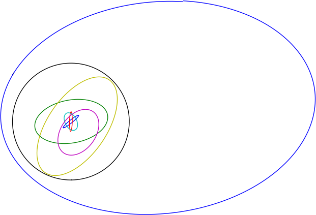

Calculates a full revolution of various orbits and plots their positions using
Matplotlib.

Compilation:

* `mkdir build`
* `cd build`
* `cmake ..`
* `make`

Running the example:

* `./generate_orbit_data ../data/orbits.tle`
* `python ../plot_orbits.py sat_track_*.dat`

This should produce a couple of plots showing the shape of the satellite orbits
in testcase.tle.  These are projected down to two of the orthogonal coordinate
axes as defined by libpredict, with center of Earth in origo.
