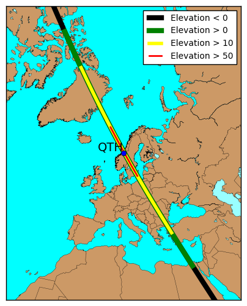
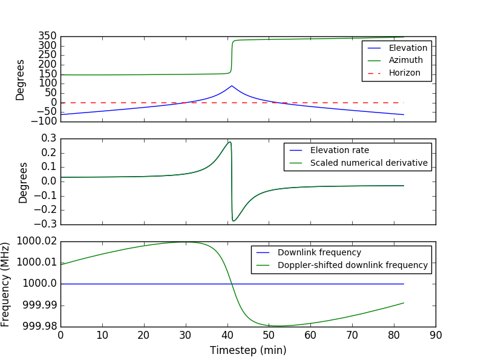

Example showing how to specify a very specific time for satellite prediction,
predict the AOS of a pass and calculate properties throughout the pass, finally
plotting these properties using Python and Matplotlib.

Compilation:

* `mkdir build`
* `cd build`
* `cmake ..`
* `make`

Running the example:

* `./generate_pass_data > pass_data`
* `python ../plot_pass.py pass_data`
